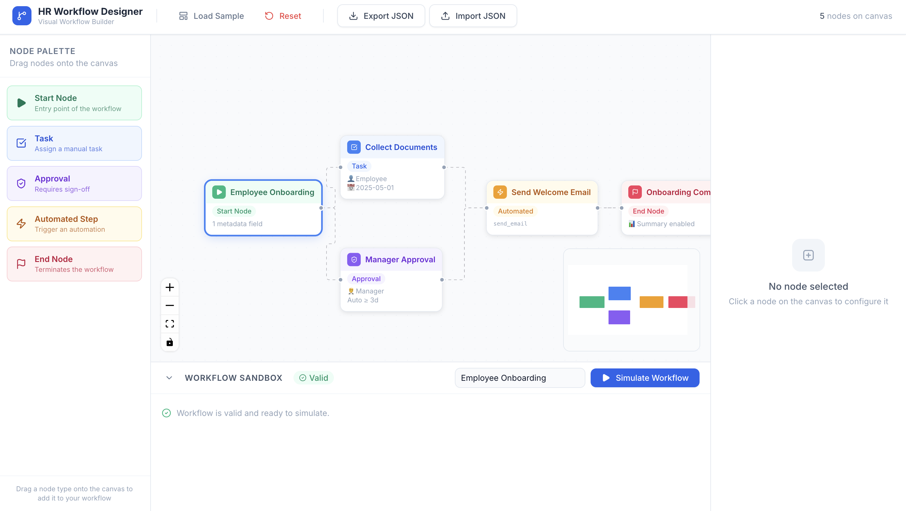

# HR Workflow Designer Module


A production-quality frontend prototype for visually creating and simulating internal HR workflows — built as a case study submission for **Tredence's Full Stack Engineering Intern** role.

## Live Links
- **Live Demo:** https://tredence-hr-workflow-designer-modul.vercel.app
- **GitHub Repository:** https://github.com/Krishgupta102/Tredence-HR_Workflow_Designer_Module

---

## Overview

The HR Workflow Designer is a visual, node-based workflow builder for HR administrators. It allows teams to model and test internal processes such as employee onboarding, leave approval, and document verification — all without writing a single line of configuration.

This submission focuses on **React architecture, graph-based UI design, dynamic form handling, workflow validation, and simulation**, closely aligned with the requirements of the Tredence case study. The project is built with a modular, scalable frontend structure using **React Flow**, **TypeScript**, **Zustand**, and **React Hook Form + Zod**.

---

## Demo Preview

> Add your screenshots inside: `public/screenshots/`

### Main Workflow Canvas


### Node Configuration Panel


### Workflow Simulation Panel


<!-- Optional: Add a GIF if available -->
<!--  -->

---

## Features

| Feature | Status |
|---|---|
| Drag-and-drop node canvas (React Flow) | ✅ |
| 5 custom node types (Start, Task, Approval, Automated, End) | ✅ |
| Left sidebar node palette | ✅ |
| Right-side dynamic configuration panel | ✅ |
| React Hook Form + Zod validation per node type | ✅ |
| Dynamic action param inputs (Automated Step) | ✅ |
| Zustand global state management | ✅ |
| Mock API layer (GET /automations, POST /simulate) | ✅ |
| Workflow validation (7 rules) | ✅ |
| Workflow simulation with step-by-step logs | ✅ |
| Validation badges on nodes | ✅ |
| Export workflow as JSON | ✅ |
| Import workflow from JSON | ✅ |
| Load sample workflow | ✅ |
| Reset canvas | ✅ |
| MiniMap + Controls (React Flow) | ✅ |
| Node count in header | ✅ |
| Collapsible sandbox panel | ✅ |
| GitHub Actions CI (Lint + Typecheck + Build) | ✅ |
| Live deployment on Vercel | ✅ |
| Docker support (optional production build) | ✅ |

---

## Tech Stack

| Library | Purpose |
|---|---|
| **Vite** | Build tool |
| **React** | UI framework |
| **TypeScript** | Type safety |
| **Tailwind CSS v3** | Styling |
| **React Flow** | Canvas & graph rendering |
| **Zustand** | State management |
| **React Hook Form** | Form state |
| **Zod** | Schema validation |
| **Lucide React** | Icons |
| **GitHub Actions** | CI workflow |
| **Vercel** | Deployment |
| **Docker + Nginx** | Optional containerized production build |

---

## Running Locally

```bash
# 1. Clone the repository
git clone https://github.com/Krishgupta102/Tredence-HR_Workflow_Designer_Module

# 2. Enter the project
cd YOUR_REPO_NAME

# 3. Install dependencies
npm install

# 4. Start the development server
npm run dev